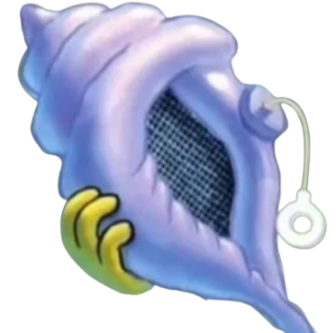

# 마법의 소라고동 [크롬 확장 프로그램]
# Magic Conch [chrome extension]
제작자: t3rryahn.dev@gmail.com


> 스폰지밥에 나온 '마법의 소라고동'을 크롬 확장 프로그램으로 만들었습니다. <br>
> 마음속으로 혹은 육성으로 예/아니오 로 답변이 가능한 질문을 하시고 고리를 당기시면, 마법의 소라고동 님이 답변을 해주십니다.


### 설치 방법
#### 크롬 웹스토어에서 받는 방법
> [크롬 웹스토어](https://chromewebstore.google.com/detail/%EB%A7%88%EB%B2%95%EC%9D%98-%EC%86%8C%EB%9D%BC%EA%B3%A0%EB%8F%99/cngadogedbklhgelahcpjofagelffgng?hl=ko)
#### 직접 설치하는 방법
1. 프로젝트 전체 폴더를 다운받는다.
2. 크롬 주소창에 [chrome://extensions/](chrome://extensions/) 접속
3. 왼쪽 위에 `압축해제된 확장 프로그램을 로드합니다.` 버튼 클릭
4. 해당 프로젝트 폴더(`magic-conch-extension`) 선택하기.

### 사용 법
고리를 드래그 했다 놓으시면 마법의 소라고동이 대답을 해줍니다.

### 답변 리스트

**긍정**
- 그럼
- 돼 (음성 5가지)

**부정**
- 가만히 있어
- 그것도 안돼
- 안돼 (음성 5가지)

**기타**
- 다시한번 물어봐
***
<br>

# 📑프로그램 설명
## 답변 선택 알고리즘
**response.js** <br>

`response.js` 파일은 사용자가 고리를 드래그하여 놓을 때마다 무작위로 답변을 선택합니다. 답변 선택 알고리즘은 다음과 같은 단계를 따릅니다:

1. **답변 카테고리 정의**:
   - 긍정 답변: `그럼`, `돼`
   - 부정 답변: `안돼`, `그것도 안돼`, `가만히 있어`
   - 기타 답변: `다시한번 물어봐`

2. **이전 답변 확인**:
   - 이전 답변이 `안돼`인 경우, 다음 답변 선택 시 `안돼`를 제외한 다른 답변을 선택합니다.

3. **가능한 답변 목록 생성**:
   - 이전 답변에 따라 가능한 답변 목록을 생성합니다.

4. **무작위 답변 선택**:
   - 가능한 답변 목록에서 무작위로 하나의 답변을 선택합니다. 이를 위해 `Math.random()` 함수를 사용하여 0과 1 사이의 난수를 생성하고, 이를 답변 목록의 길이와 곱한 후 `Math.floor()` 함수를 사용하여 정수로 변환합니다.
   - 예를 들어, 긍정 답변 목록에서 무작위로 답변을 선택하는 코드는 다음과 같습니다:
     ```javascript
     const randomIndex = Math.floor(Math.random() * positiveAudios.length);
     const randomResponse = positiveAudios[randomIndex];
     ```

5. **선택된 답변 출력 및 음성 재생**:
   - 선택된 답변을 화면에 출력하고, 해당 답변에 맞는 음성을 재생합니다.

이 알고리즘을 통해 마법의 소라고동은 무작위로 답변을 선택하여 사용자에게 제공합니다.


## 고리 드래그 기능
**pull-ring.js** <br>

`pull-ring.js` 파일은 사용자가 마법의 소라고동의 고리를 드래그할 때 발생하는 모든 상호작용과 애니메이션을 처리합니다.

1. **고리의 위치 및 회전**:
   - **고리의 이동**: 사용자가 마우스로 고리를 클릭하고 드래그하면, `mousedown`, `mousemove`, `mouseup` 이벤트를 활용하여 고리의 위치를 업데이트합니다.
     ```javascript
      pullRing.addEventListener('mousedown', onDragStart);
      document.addEventListener('mousemove', onDrag);
      document.addEventListener('mouseup', onDragEnd);
     ```
   - **회전 구현**: 고리가 이동할 때, 고리의 상단이 항상 원래 위치를 향하도록 회전합니다. 이를 위해 고리의 현재 위치와 초기 위치 사이의 벡터를 계산하고, Math.atan2 함수를 사용하여 회전 각도를 구했습니다.
     ```javascript
      const deltaX = initialX - currentX;
      const deltaY = initialY - currentY;
      const angle = Math.atan2(deltaY, deltaX) * (180 / Math.PI) + 90;
      pullRing.style.transform = `translate(${x}px, ${y}px) rotate(${angle}deg)`;
     ```
   - **회전 중심 설정**: 고리 이미지의 회전 중심(transform-origin)을 이미지의 중앙 상단으로 설정하여 자연스러운 회전이 이루어지도록 했습니다.
     ```javascript
      #pull-ring {
        transform-origin: center top;
      }
     ```


2. **끈의 움직임과 연결**:
   - **끈의 동적 생성**: 끈은 고리와 소라고동 사이를 연결하는 요소로, 고리의 움직임에 따라 길이와 각도가 동적으로 변경됩니다.
   - **끈의 길이 계산**: 고리의 상단 중심과 소라고동의 고정된 위치 사이의 거리를 계산하여 끈의 길이를 설정했습니다.
     ```javascript
      const distance = Math.sqrt(deltaX * deltaX + deltaY * deltaY);
      pullString.style.height = `${distance}px`;
     ```
   - **끈의 회전 각도 계산**: 끈이 정확한 방향을 가리키도록 고리와 소라고동 사이의 각도를 계산하여 적용했습니다.
     ```javascript
      const angle = Math.atan2(deltaY, deltaX) * (180 / Math.PI) - 90;
      pullString.style.transform = `rotate(${angle}deg)`;
     ```
   - **끈의 시작점 설정**: 끈의 transform-origin을 상단 중앙으로 설정하여 회전 및 길이 변경 시 시작점이 고정되도록 했습니다.
     ```javascript
      #pull-string {
        transform-origin: top center;
      }
     ```

3. **애니메이션 효과**:
   - **드래그 시 부드러운 움직임**: 고리와 끈의 움직임이 부드럽게 보이도록 CSS 전환 효과와 JavaScript를 활용하여 애니메이션을 구현했습니다.
   - **고리를 놓을 때의 애니메이션**: 사용자가 고리를 놓으면 고리가 원래 위치로 돌아가도록 애니메이션을 추가했습니다. 이때 이징 함수를 사용하여 자연스러운 복귀 효과를 연출했습니다.
     ```javascript
      function animateReturnToOrigin() {
        // 이징 함수와 requestAnimationFrame을 사용하여 애니메이션 구현
      }
     ```


## 추가 업데이트 계획
**tts 기능**
크롬 자체 tts(text to speach) 를 사용해 마이크로 질문하면 텍스트로 입력받는 기능.

